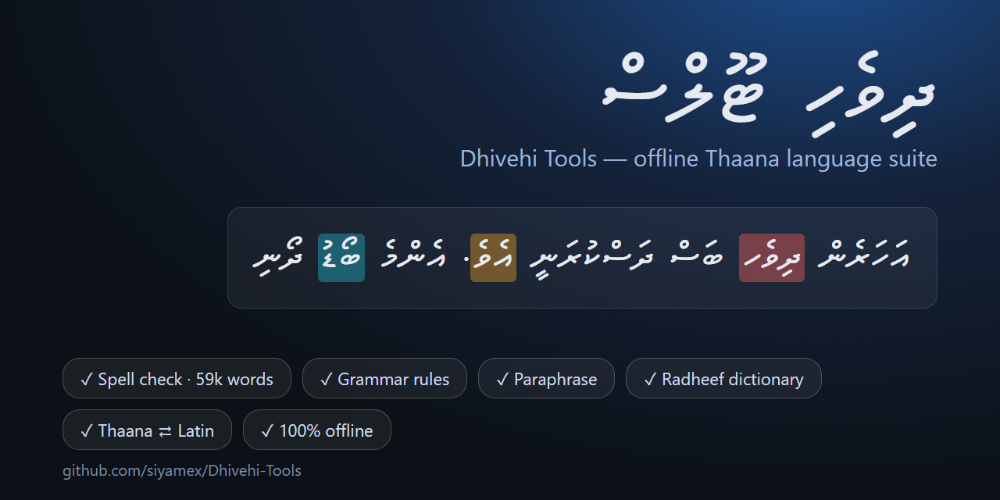
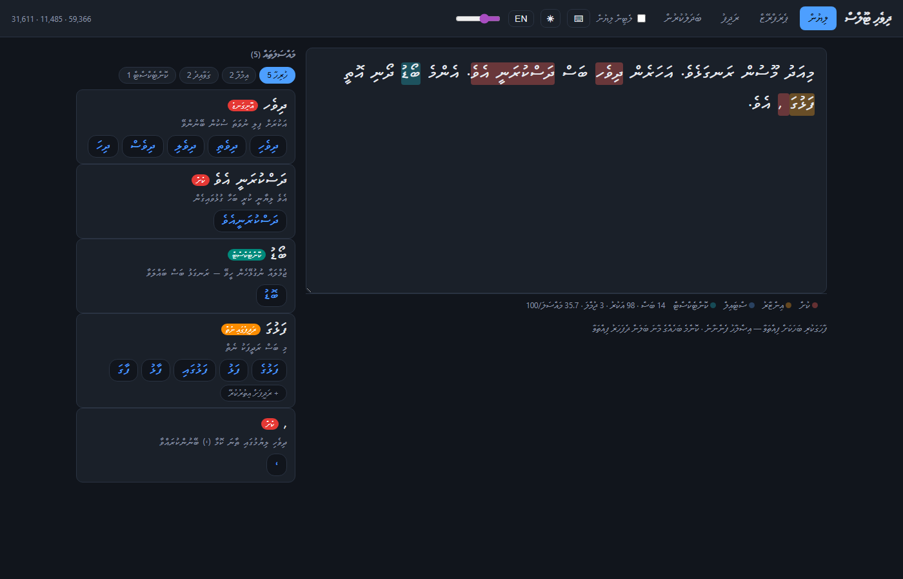

# Dhivehi Tools (offline)



Offline language tools for Dhivehi (Thaana script), pure Python 3 standard
library — no dependencies, no network calls, no models to download.

Five tools under one roof, sharing one engine and one web UI:

| Tool | What it does |
|---|---|
| **Spell checker** | Thaana validation + 59,366-word lexicon (Radheef + Wikipedia corpus) + morphology + context-aware suggestions |
| **Grammar checker** | rule-based: punctuation, spacing, repeated words, detached އެވެ, register consistency |
| **Paraphraser** | synonym rewriting from a 7,400-pair Radheef thesaurus, with a modern-words-only mode |
| **Dictionary** | full Radheef lookup (31,611 headwords), prefix browsing, **reverse search** (find words by meaning) |
| **Converter** | Thaana ⇄ Latin transliteration and formal ⇄ informal register conversion |

Plus, across all editors: a **Latin-typing IME** (type `dhivehi`, press space,
get ދިވެހި — runs client-side via the JS engine port), **real-word error
detection** (ބޯޑު after އެންމެ flags with suggestion ބޮޑު: zero bigram
support while a one-fili sibling has strong support; 0 false positives on
3,000 real bigram pairs), and **verb conjugation** in the morphology (the
regular -ުން class: ކުރުން → ކުރަނީ/ކުރި/ކުރާނެ/ކުރެވޭ/ކުރަމުން…).

Measured quality (synthetic-error benchmark, `scripts/evaluate.py`):
**95.5% error detection, 87.8% top-1 / 94.2% top-5 suggestion accuracy,
0% false positives** on clean words.

## Quick start

```
python -m dhivehi_tools serve        # unified tabbed UI at http://127.0.0.1:8765
```

CLI equivalents:

```
python -m dhivehi_spell check "TEXT" | suggest WORD | validate WORD
python -m dhivehi_tools grammar "TEXT" [--json]
python -m dhivehi_tools paraphrase "TEXT" [--aggressiveness 0.6] [--seed 3]
```

Library:

```python
from dhivehi_tools import SpellChecker, GrammarChecker, Paraphraser

SpellChecker().check_text("...")                 # spelling issues + offsets
GrammarChecker().check("...")                    # grammar issues + fixes
Paraphraser().paraphrase("...", 0.6, seed=3)     # rewritten text + swap info
```

---

## 1. Spell checker

Four layers, cheapest first:

**Tokenization** — Thaana word runs (U+0780–U+07B1) with offsets; ZWNJ/ZWJ
stripped; Latin/digits ignored.

**Structural validation** (no dictionary needed) — every Thaana consonant
must carry exactly one fili or sukun; the one systematic exception is bare
noonu before ބ ޑ ދ ގ (prenasalized stops: ކަނޑު, ހަނދު). Reports
`missing-fili` / `orphan-fili` with exact offsets. Sukun-initial loanwords
(ސްކޫލް) pass.

**Lexicon + suffix heuristics** — ~31,600 words generated from the Radheef
dump (`scripts/build_lexicon.py`) plus a curated seed list. An exact lexicon
hit trumps the structural rule (Radheef has 115 archaic/dialectal spellings
like ހީނލުން that are valid despite breaking it). Unknown words get common
case endings stripped (ގައި، ގެ، އަށް، އިން، ތައް، އެއް…) with the two main
sandhi rules reversed: stem-final ު → ް (ރަށުގައި → ރަށް) and
suffix-consumed sukun (ފޮތެއް → ފޮތް).

**Suggestions** — SymSpell-style deletes index over consonant+fili *units*
(compact 2-chars-per-unit string keys), ranked by weighted
Damerau-Levenshtein:

| Edit | Cost |
|---|---|
| short ↔ long fili (ަ/ާ, ި/ީ, …) | 0.40 |
| consonant from same confusion set | 0.50 |
| other fili substitution | 0.70 |
| transpose adjacent units | 0.80 |
| insert / delete a unit | 1.00 |

Confusion sets cover the Arabic-loan letters that sound identical in speech:
ހ/ޙ/ޚ، ސ/ޘ/ޞ، ށ/ޝ، ޒ/ޛ/ޟ/ޡ، ތ/ޠ، އ/ޢ، ގ/ޣ، ކ/ޤ، ވ/ޥ، ނ/ޏ/ޱ — so
ސުކުރިއްޔާ → ޝުކުރިއްޔާ at cost 1.0, ahead of unrelated words. Ties break
by frequency.

Performance: ~0.6 s startup, ~100 MB RAM, 0–4 ms per word.

## 2. Grammar checker

Rule-based, [grammar.py](dhivehi_tools/grammar.py). Each issue carries a
severity (error / warning / style), offsets, and — where possible — a
ready-to-splice `replacement`:

- **thaana-comma / question / semicolon** — Latin `,` `?` `;` after a Thaana
  word → ، ؟ ؛ (span absorbs preceding spaces so fixes are clean)
- **space-before-punct**, **space-after-punct**, **double-space**
- **repeated-word** — identical adjacent words (warning: emphasis
  reduplication exists, so never auto-fixed silently)
- **detached-eve** — the sentence-final particle އެވެ must attach to the
  preceding word, with real morphophonology in the suggested fix:
  ކުރި + އެވެ → ކުރިއެވެ; ކަމަށް + އެވެ → ކަމަށެވެ (sukun fuses);
  ދޯނީގައި + އެވެ → ދޯނީގައެވެ (އި contracts)
- **formal-register** — if ≥60% of sentences end in -ެވެ (formal written
  register), sentences that don't are flagged (style)
- **long-sentence** — more than 40 words (style)

## 3. Paraphraser

[paraphrase.py](dhivehi_tools/paraphrase.py), powered by
`dhivehi_tools/data/thesaurus.tsv` — built by `scripts/build_thesaurus.py`
from a happy property of the Radheef dump: thousands of definitions are a
single word, i.e. a synonym (ހަހަރު → ލޯބި). Harvest yields **7,078
bidirectional pairs covering 10,979 words**, all verified against the spell
lexicon, so a paraphrase can never introduce a misspelling.

`paraphrase(text, aggressiveness, seed)` swaps a seeded-random subset of
swappable words and reports every candidate with its alternatives, so the
UI lets you click any highlighted word to cycle through synonyms, regenerate
with a new seed, or copy the result. Deterministic for a given seed.

## Web UI



One installable PWA ([index.html](dhivehi_tools/web_static/index.html))
served by a stdlib HTTP server ([web.py](dhivehi_tools/web.py)) on localhost:

- **Write** — unified editor running spelling + grammar + context checks
  together: severity-colored inline highlights, filterable issue panel
  (All / Spelling / Grammar / Context), click a highlighted word for an
  inline suggestion popover, double-click *any* word for its Radheef
  definition, live word/char/sentence counts and issues-per-100-words
- **Paraphrase** — strength slider, modern-only toggle, regenerate,
  click-to-cycle synonyms, copy
- **Dictionary** — lookup, prefix browsing, reverse (search-by-meaning)
- **Convert** — Thaana ⇄ Latin and formal ⇄ informal register
- Chrome: **MV Typer** font (bundled, served locally), dark mode
  (auto + toggle), **English/Dhivehi UI language toggle**, Thaana font-size
  slider, **on-screen Thaana keyboard**, Latin-typing IME in every editor,
  mobile layout with a bottom tab bar, `?embed=1&tab=…` for iframing a
  single tool into another site, and a service worker for offline use
- Definitions render inside `<bdi>` so mixed RTL/LTR dictionary text
  doesn't garble

JSON API: `POST /api/spell/check`, `/api/spell/add`, `/api/grammar/check`,
`/api/paraphrase`, `/api/define`, `/api/reverse`, `/api/translit`,
`/api/register`; `GET /api/stats`, `/api/unknowns`; LanguageTool
`POST /v2/check`. CORS enabled so the page also works from file:// or
editor preview panes.

## Morphology, corpus, and context

**Morphology** ([morphology.py](dhivehi_tools/morphology.py)): the nominal
paradigm (case endings, plurals, the ތަކު- oblique series, sociative ާއި,
the ސް→ހ and ން→މ stem mutations, stacked އެވެ) is encoded as ~90
mechanically *invertible* suffix-replacement rules. One table drives
`generate()` (stem → all forms), `analyze()` (form → dictionary stems, used
by the spell checker), and the Hunspell SFX export — with round-trip tests
guaranteeing they agree.

**Corpus** (`scripts/build_corpus.py`): the Dhivehi Wikipedia dump (9,846
pages, 868k tokens) contributes 27,730 new well-formed words with real
frequencies, plus 45,074 bigrams. Suggestions are re-ranked in context: a
candidate forming a known bigram with a neighbouring word outranks
equally-distant alternatives. Joined compounds whose halves are both
dictionary words (ދިވެހިބަސް) are accepted automatically.

**Unknown-word loop**: every unknown word users type is counted; review the
queue at `GET /api/unknowns` and promote real words to the lexicon.

## Distribution

- **Hunspell export**: `python scripts/export_hunspell.py` writes
  `dist/dv_MV.dic` + `dv_MV.aff` (lexicon + morphology as SFX rules + REP
  confusion pairs) — drop into LibreOffice/Firefox/Thunderbird for native
  Dhivehi spell check with zero runtime.
- **LanguageTool protocol**: the server implements `POST /v2/check`
  (form-encoded, LT-JSON out), so existing LanguageTool clients and editor
  plugins can point at `http://127.0.0.1:8765` and get Dhivehi spelling +
  grammar.
- **PyPI-ready packaging**: `pyproject.toml` with `dhivehi-tools` /
  `dhivehi-spell` console scripts.
- **Client-side bundle**: `python scripts/export_web.py` builds
  `dist/web/` (index.html + dhivehi.js + lexicon.js, 1.5 MB total) — the
  spell checker and IME running entirely in the browser with no server.
  Host it on any static site (e.g. radheef.siyamex.com) or open from disk.
- **CI quality gate**: `.github/workflows/ci.yml` runs all 95 tests plus
  the benchmark with thresholds (detection ≥92%, top-1 ≥82%, FP ≤0.5%) —
  a change that degrades the checker fails the build.
- **News corpus pipeline**: `scripts/build_news_corpus.py` (process saved
  pages, or politely fetch a URL list) + `scripts/merge_corpora.py` to fold
  news counts into the lexicon and bigram data.

## Regenerating the data

```
python scripts/build_lexicon.py      data_raw/data-radheef.js   # -> radheef.tsv
python scripts/build_definitions.py  data_raw/data-radheef.js   # -> definitions.tsv
python scripts/build_corpus.py       data_raw/dvwiki-*.xml.bz2  # -> corpus.tsv, bigrams.dat
python scripts/build_thesaurus.py    data_raw/data-radheef.js   # -> thesaurus.tsv (after corpus)
python scripts/export_hunspell.py                               # -> dist/dv_MV.*
python scripts/evaluate.py --n 500                              # quality metrics
```

## Tests

```
python -m unittest discover -s tests -v     # 95 tests
```

Covers script validation, lexicon integrity, morphology round-trips,
suffix sandhi, suggestion ranking, compound acceptance, every grammar rule
(including clean-splice fix application), paraphrase determinism/offset
integrity/lexicon safety, transliteration both ways, register conversion
round-trips, and all web endpoints including the LanguageTool protocol.

## Layout

```
dhivehi_spell/            spelling engine (also usable standalone)
  thaana.py               script rules: tokenizer, unit parser, validator
  dictionary.py           lexicon + SymSpell-style unit-deletes index
  suggest.py              weighted Damerau-Levenshtein, ranking
  checker.py              orchestration, morphology/compound/context hooks
  web.py, web_static/     standalone spelling-only UI
  data/wordlist.tsv       curated seed lexicon
  data/radheef.tsv        generated Radheef lexicon (31,600 words)
  data/corpus.tsv         generated Wikipedia lexicon (27,730 words)
  data/bigrams.dat        generated bigram counts (45,074)
dhivehi_tools/            umbrella package
  morphology.py           invertible inflection rules (generate/analyze)
  grammar.py              rule-based grammar checker
  paraphrase.py           thesaurus-based paraphraser (modern-only mode)
  translit.py             Thaana <-> Latin transliteration
  transform.py            formal <-> informal register conversion
  web.py, web_static/     unified tabbed UI + JSON API + LanguageTool API
  data/thesaurus.tsv      generated thesaurus (7,403 pairs, corpus-tagged)
  data/definitions.tsv    generated Radheef definitions (31,669 senses)
scripts/                  build_lexicon, build_definitions, build_corpus,
                          build_thesaurus, export_hunspell, evaluate
dist/dv_MV.dic, .aff      Hunspell export
data_raw/                 Radheef dump, Wikipedia dump, unigram counts
tests/                    86 unit tests
```
